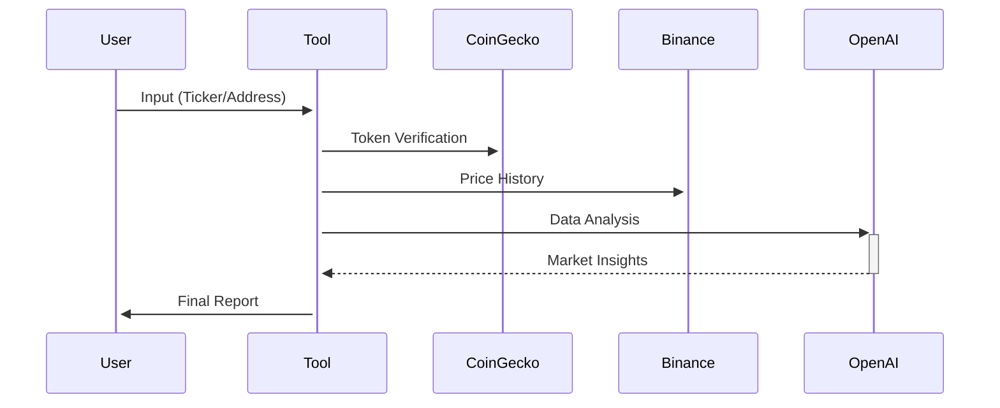

# AI-Powered Cryptocurrency Analysis Tool 🤖📊

[](https://x.com/rpl_0x)
[](https://www.instagram.com/roleplayinglife_0x/)

*A practical example of AI implementation in financial analysis - perfect for learning modern automation techniques!*

---

## 🚀 Features

- **Multi-Source Identification**  
  Recognize tokens by ticker (BTC), name (Bitcoin), or contract address
- **Smart Historical Analysis**  
  90-day price action visualization and pattern detection
- **AI Prediction Engine**  
  Probability-based forecasts with risk assessment
- **Technical Insights**  
  Support/resistance levels, volume analysis, trend identification
- **Actionable Reports**  
  PDF/Text outputs with clear recommendations

---

## 💻 Installation

### Requirements
- Python 3.8+
- Basic terminal knowledge
- Free OpenAI API key

1. **Clone Repository**
```bash
git clone https://github.com/yourusername/crypto-ai-tool.git
cd crypto-ai-tool
```
2. **Install Dependencies**
```bash
pip install -r requirements.txt
```
3. **Configure Environment**
```bash
echo "OPENAI_API_KEY=your_openai_key_here" > .env
echo "OPENAI_BASE_URL=https://models.inference.ai.azure.com" >> .env
```
### 🏃 Quick Start

#### Run Analysis
```bash
python token_analyzer.py
```

#### Enter Cryptocurrency Identifier
```bash
Enter token ticker/name/contract address: ETH
```

#### Wait for Processing
```
[1/3] Identifying token... Success!
[2/3] Fetching historical data... 90 days loaded
[3/3] AI analysis... Completed
```

#### Find Report
```bash
Report saved to: analysis_ETH_20231025.txt
```

---

## 📑 Sample AI Report

```
## Historical Analysis (Last 90 Days)
- 22% price increase since last month
- Strong support at $1,550 (tested 3x)
- Rising volume during upward moves

## Prediction (75% Confidence)
▲ Bullish Scenario: Potential rally to $1,850 (+18%)  
▼ Bearish Case: Risk of drop to $1,480 (-6%)

## Key Technicals
- RSI: 62 (neutral-bullish)
- 50-day MA crossing above 200-day MA
- Current price 12% above VWAP

## Recommendations
✅ Accumulate below $1,600  
⏱️ Take profits at $1,800  
⛔ Stop-loss at $1,520
```

---

## 🧠 How It Works

### Data Flow



### Key Components

#### Token Recognition
Uses CoinGecko's public API to identify 50,000+ assets

#### Historical Data
Fetches OHLC (Open-High-Low-Close) data from Binance

#### AI Analysis
GPT-4 Turbo model with custom financial prompt engineering:

```python
"Analyze {data}. Highlight patterns, calculate probabilities, and explain reasoning like a professional trader."
```

#### Risk Management
Automatic confidence scoring and risk warnings

---

## ⚠️ Important Notes

### Not Financial Advice
Predictions are experimental - always verify with other sources

### API Limitations
Free tier has 10 requests/minute (CoinGecko/Binance)

### Data Freshness
Historical data updates every 24 hours

### AI Accuracy
Model trained until 2023-10 - may miss latest events

---

## 📜 License

MIT License - Free for educational and commercial use

---

Follow for More AI Projects:  
[](https://x.com/rpl_0x)  
[](https://www.instagram.com/roleplayinglife_0x/)

**"The future of finance is automated - start learning today!" 🚀💡**
